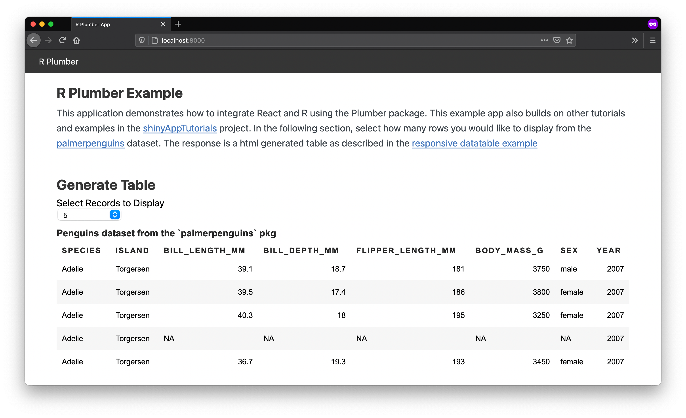

# R Plumber ❤️ React



The `r-plumber-react` app demonstrates how to create a React application that uses R plumber as a backen. This app replicates the [responsive datatables](https://davidruvolo51.github.io/shinytutorials/tutorials/responsive-tables/) tutorial. This application uses following tools.

- Backend
    - R Plumber: [https://www.rplumber.io](https://www.rplumber.io)
    - Node: [https://nodejs.org/](https://nodejs.org/)
- Frontend
    - React: [https://reactjs.org](https://reactjs.org)
    - Vite: [https://vitejs.dev](https://vitejs.dev)

## Getting Started

### 1. Install the dev dependencies

Make sure [Node and NPM](https://nodejs.org/en/) are installed on your machine. You may also use [Yarn](https://yarnpkg.com/en/). To test the installation or to see if these tools are already installed on your machine, run the following commands in the terminal.

```shell
node -v
npm -v
```

### 2. Clone the `r-plumber-app` repository

```shell
git clone https://github.com/davidruvolo51/r-plumber-app
```

### 3. Install dependencies

Next, install the npm packages that are required to run the app locally. I have decided to use [pnpm](https://github.com/pnpm/pnpm) to manage packages on my machine and across projects. To install `pnpm`, run the following command.

```shell
npm install -g pnpm
```

You will need to install the dependencies in the root directory and in the `client/` directory.

```shell
pnpm install

cd client
pnpm install
```

If you prefer to use `npm`, use the following.

```shell
npm install

cd client
npm install
```

### 4. Install the required R packages

This application uses [renv](https://github.com/rstudio/renv) to manage R packages. Make sure `renv` is installed and restore the library.

```r
renv::restore()
```

### 5. Start the development servers

When you have installed everything, navigate back to the main directory and start the development server.

```bash
# if using npm
npm run dev

# if using yarn
yarn dev
```

This will start Plumber API and parcel. The client will be hosted at `localhost:8000`.
